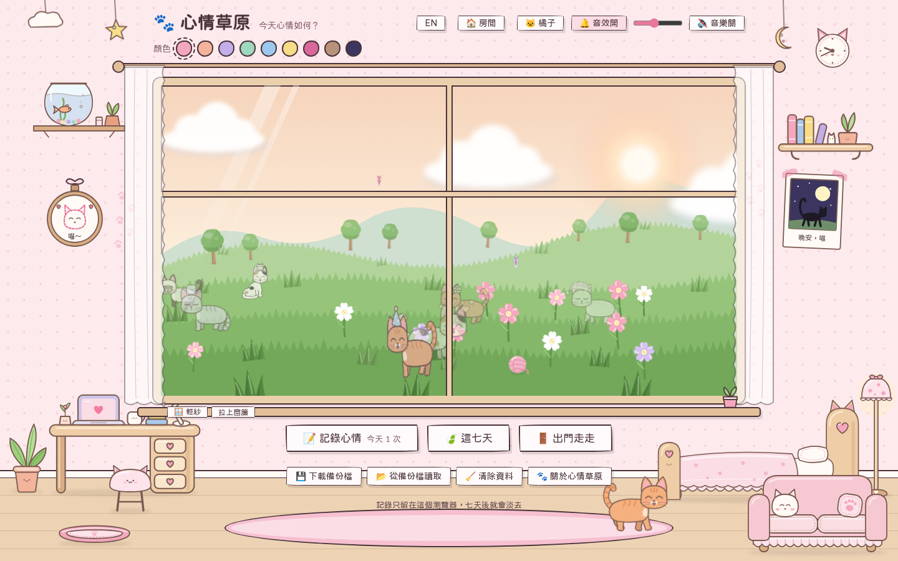
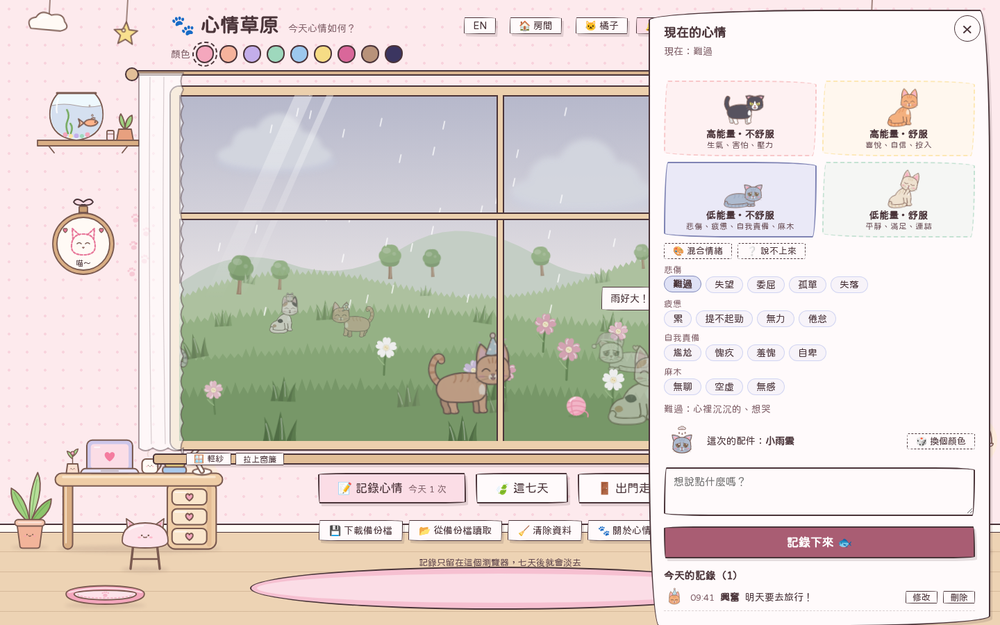
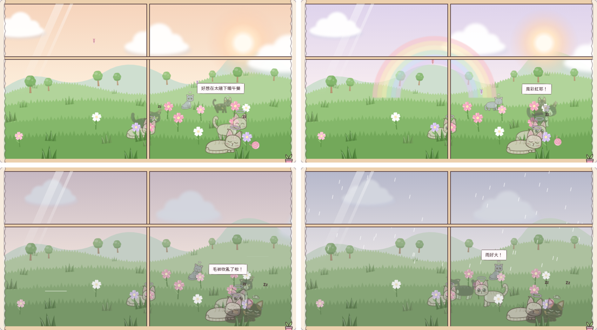
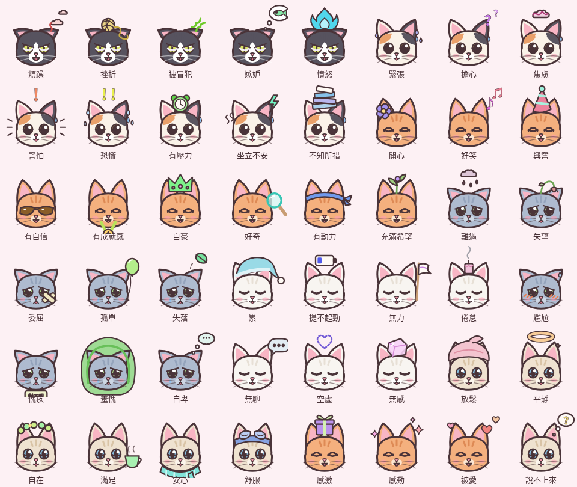
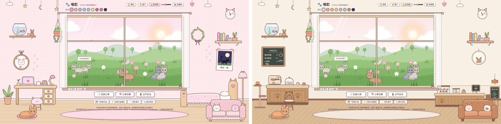
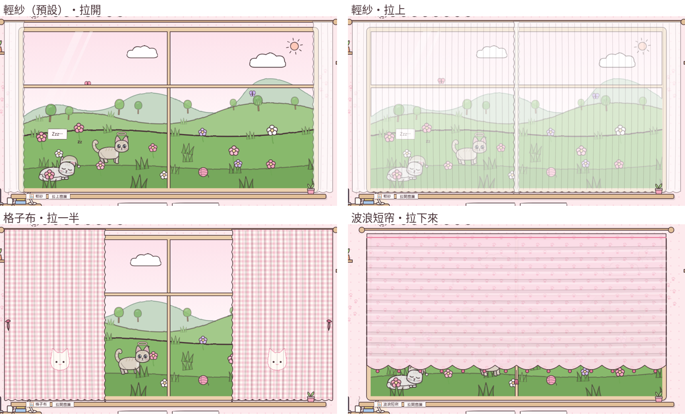
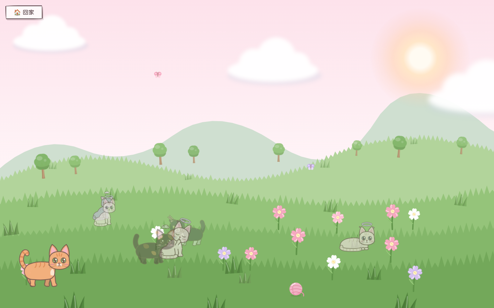
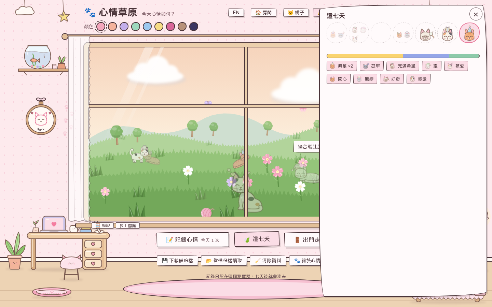
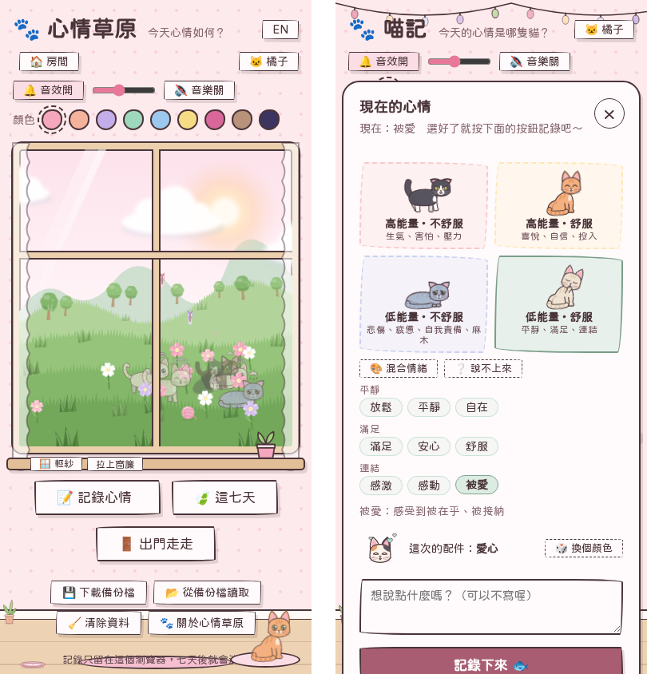

# Mood Meadow 心情草原

[中文](README.md) | **English**

A small web page for practicing noticing and expressing your feelings. Pick the feeling closest to how you feel right now, and a cat runs into the meadow outside the window while the sky changes with your mood. There's also a cat of your own living in the room.

Mood Meadow only keeps the last 7 days: the older an entry gets, the fainter its cat becomes in the meadow, and after 7 days it's gone.

No install, no sign-up — just open the page. Everything stays in your own browser.

**Try it online: <https://ruby510054.github.io/meow/>** (switch to English with the "EN" button in the top right)



> The screenshots show the Chinese interface; everything is also available in English.

## Excerpt

> 「當別人問，今天海上天氣好嗎？妳聽到了，妳聽到，都要回答很晴朗。」
> 「即使下這麼大的雨也要這樣回答嗎？」
> 「是。」
> 「即使不想回答也要這樣回答嗎？」
> 「是。」
>
> — Wu Ming-Yi, *The Man with the Compound Eyes* (《複眼人》)

> "When someone asks you, 'How's the weather out at sea today?' — whenever you hear it, you must answer: 'Clear and sunny.'"
> "Even when it's raining this hard?"
> "Yes."
> "Even when I don't want to answer?"
> "Yes."
>
> (our translation)

> Mood Meadow is a small practice tool and can't replace professional help. If you often feel you can't cope, or have thoughts of hurting yourself, please talk to someone you trust or contact a local helpline. In Taiwan:
> - **Taiwan Mental Health Hotline 1925** (24 hours, free)
> - **Lifeline 1995**
> - **Teacher Chang 1980**

## Features

### Log your mood
- Pick one of four areas (energy × pleasantness), then the closest of 47 feeling words — each comes with a short description
- The four areas sort feelings by pleasantness (valence) and energy (arousal), based on the circumplex model of affect (Russell, 1980)
- Choose "Mixed" to pick several words; if you're "Not sure", you can log how your body feels and what it's about instead
- Log as many times a day as you like, and edit, delete, or add entries for any of the last 7 days



### Mood weather
The sky outside follows your mood: happy is sunny, calm brings a rainbow, irritated gets windy, sad brings rain.



### The meadow
- Every entry sends a cat into the meadow. Its coat depends on the feeling's family (14 coats), and it wears a little accessory for that feeling
- Cats walk, play and snuggle; their moves and expressions depend on the mood
- Click a cat to hear about that day's mood; click the grass to drop a fish snack, or kick the yarn ball
- Cats react to the weather and scenery too: they hide from the rain and curl up, jump at thunder, roll around in the sun, and chat about flowers, butterflies and clouds
- The older the entry, the fainter its cat; after 7 days it no longer appears



### The room and your pet
- A cat of your own lives in the room. It runs around, chases its tail, naps on the bed and sofa, and now and then makes mischief on the desk. Its expression follows your mood, and petting it makes hearts float up
- Give it a name and pick its coat
- Two rooms to choose from: the pink cottage and the cat café, each with its own furniture
- Three curtain styles, which you can drag open and closed





### Go outside
Press "Go outside" to take your pet out to the meadow and play with the other cats up close.



### These 7 days
"These 7 days" shows the cats from the last week, fainter the further back they are, along with the mood colors and the feelings that came up.



### More
- Piano background music, and meows and purrs when you pet a cat — each can be turned on or off
- The pink cottage has 9 color themes; the cat café has its own set of drink colors (milk, latte, caramel, strawberry milk, matcha, blueberry yogurt, hojicha, night sky). Each room remembers its own choice
- Switch between Chinese and English with the "EN" button; English feeling words come from `label.en` in `mood.json`
- Works on desktop and mobile



## Getting started

### Online
Just open <https://ruby510054.github.io/meow/>. A recent version of Chrome, Edge, Firefox or Safari is recommended.

### On your own computer
Download or clone this project and open `index.html` in a browser.

### On your own GitHub Pages
1. Fork this repo (or push the project to your own repo)
2. Go to the repo's **Settings → Pages**
3. Under **Source**, choose **Deploy from a branch**, pick the `main` branch and the `/ (root)` folder, then press **Save**
4. After a minute or two, it will be live at `https://<your-account>.github.io/<repo-name>/`

## Data and privacy

- Entries are stored only in **your own browser** (localStorage) and are never uploaded anywhere
- Only the **last 7 days** (including today) are kept; older entries are deleted automatically, and loading a backup only brings in entries from those 7 days
- If you clear your browser data or switch browsers or computers, your entries won't be there. To move them, use "Download backup" at the bottom of the page, then "Load from backup"
- Opening the local `index.html` and opening the GitHub Pages URL don't share entries; use a backup file to move them
- To start over, use "Clear data"

## Customizing feelings

The feelings are defined in [`mood.json`](mood.json):

```text
quadrants (4 areas: energy × pleasantness)
└─ families (feeling families, e.g. "Sadness")
   └─ emotions (feeling words)
        id, label.zh, label.en, desc (description)
        valence (pleasantness, -1 ~ 1), arousal (energy, -1 ~ 1)
special_options: mixed, unsure
```

So the page works as a single file, `index.html` contains an identical copy (inside `<script type="application/json" id="emotionData">`). After editing `mood.json`, replace that whole block with the new content.

- `valence` and `arousal` drive the mood weather and the cats' behavior
- New feeling words without their own accessory use their family's accessory
- Which face and coat a new family uses is set in `FAMILY_FACE` and `FAMILY_COAT` in `index.html`
- English feeling words use `label.en`; English descriptions (`desc`) go in the `EN` table in `index.html`

## Tech

- The whole site is one `index.html`: plain HTML, CSS and JavaScript, with no packages and no build step
- Cats, furniture and weather are SVGs drawn in code
- Background music and purring are synthesized live with the Web Audio API; meows are trimmed real recordings embedded in the file
- The font is [jf open Huninn](https://fonts.google.com/specimen/Huninn) from Google Fonts; it needs an internet connection, otherwise the system font is used

```text
.
├── index.html     # the whole site
├── mood.json      # feeling definitions
├── README.md      # Chinese README
├── README.en.md   # English README
├── LICENSE        # MIT license
└── docs/          # screenshots for the README
```

## References

Research that informed the design:

- Putting feelings into words is itself a way of regulating them (Lieberman et al., 2007)
- People who can tell subtle feelings apart cope better with unpleasant emotions (Kashdan, Barrett & McKnight, 2015)
- Writing about emotional experiences has positive effects on physical and mental health (Pennebaker, 1997)

- Lieberman, M. D., Eisenberger, N. I., Crockett, M. J., Tom, S. M., Pfeifer, J. H., & Way, B. M. (2007). Putting feelings into words: Affect labeling disrupts amygdala activity in response to affective stimuli. *Psychological Science, 18*(5), 421–428.
- Kashdan, T. B., Barrett, L. F., & McKnight, P. E. (2015). Unpacking emotion differentiation: Transforming unpleasant experience by perceiving distinctions in negativity. *Current Directions in Psychological Science, 24*(1), 10–16.
- Pennebaker, J. W. (1997). Writing about emotional experiences as a therapeutic process. *Psychological Science, 8*(3), 162–166.
- Russell, J. A. (1980). A circumplex model of affect. *Journal of Personality and Social Psychology, 39*(6), 1161–1178.

## Credits

The meow recordings come from Wikimedia Commons, trimmed to mono, with adjusted volume and raised pitch:

| Recording | Author | License |
|---|---|---|
| [2015-11-24.νιαούρισμα.Νιάου.noise reduced.flac](https://commons.wikimedia.org/wiki/File:2015-11-24.%CE%BD%CE%B9%CE%B1%CE%BF%CF%8D%CF%81%CE%B9%CF%83%CE%BC%CE%B1.%CE%9D%CE%B9%CE%AC%CE%BF%CF%85.noise_reduced.flac) | Tsester | CC0 |
| [Meow of a Siamese cat - freemaster2.wav](https://commons.wikimedia.org/wiki/File:Meow_of_a_Siamese_cat_-_freemaster2.wav) | freemaster2 | CC0 |
| [Weibliche Britisch Kurzhaar will Futter C1277 MIAUEN.wav](https://commons.wikimedia.org/wiki/File:Weibliche_Britisch_Kurzhaar_will_Futter_C1277_MIAUEN.wav) | PantheraLeo1359531 | [CC BY 4.0](https://creativecommons.org/licenses/by/4.0/) |

The font [jf open Huninn](https://github.com/justfont/open-huninn-font) (justfont) is licensed under the [SIL Open Font License 1.1](https://openfontlicense.org/).

## Author

[@ruby510054](https://github.com/ruby510054)

## License

The code is released under the [MIT License](LICENSE) — feel free to use, modify and share it, as long as you keep the original license notice.

The meow recordings and the font follow their own licenses listed under Credits above, and are not covered by the MIT License.
